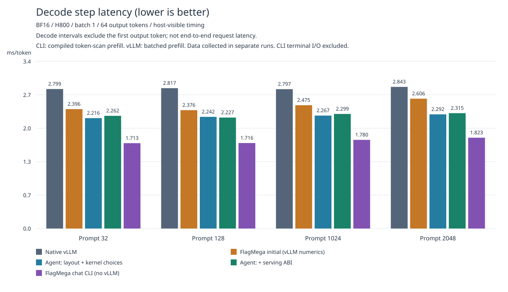
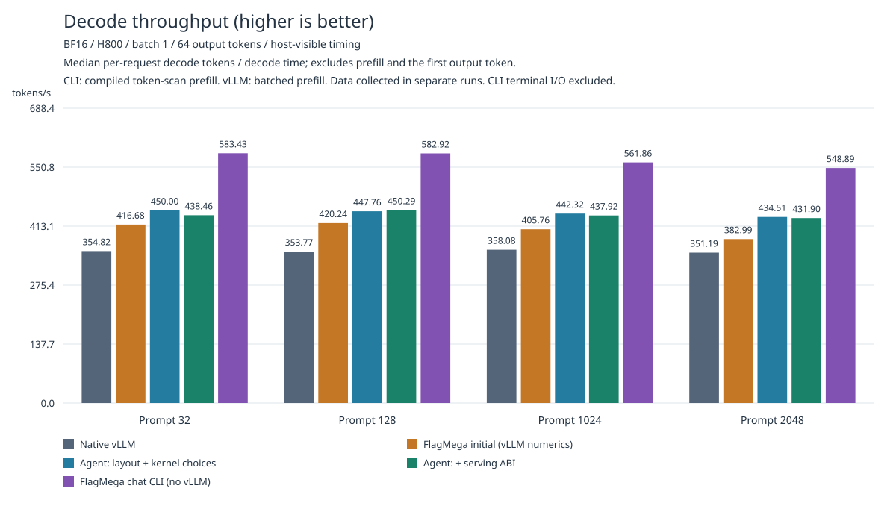
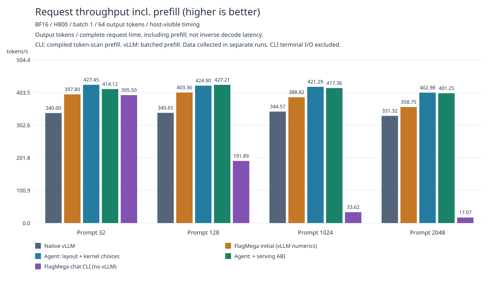

# Qwen3-1.7B BF16 / H800: Agent Optimization and vLLM Reproduction

## Reproduction

Prerequisites: this repository's TLE-enabled FlagTree, one H800, PyTorch
`2.10.0+cu128`, Transformers `4.57.6`, and huggingface-hub `0.36.0`.
Use vLLM's `nncase` branch at commit
`493bd8323b64ad778f802b41ddd3109740910bc8`, not an arbitrary upstream release.
The out-of-tree adapter uses that branch's existing `nncase_executor` slot to
execute a FlagMega artifact. vLLM is needed only for the vLLM comparison below;
the standalone chat CLI needs FlagTree, PyTorch, and the tokenizer dependencies,
but does not import vLLM or execute a Transformers model forward.

Prepare the Qwen/Qwen3-1.7B checkpoint at revision
`70d244cc86ccca08cf5af4e1e306ecf908b1ad5e`. Run the following commands from the
repository root, using a Python environment that can import both this FlagTree
checkout and the pinned vLLM build.

```sh
export TUTORIAL="$PWD/python/tutorials/flagmega/01-qwen3-1.7b-bf16/nvidia-h800"
export PYTHONPATH="$PWD/python:$TUTORIAL${PYTHONPATH:+:$PYTHONPATH}"
export CUDA_VISIBLE_DEVICES=0  # Choose an idle H800; use the same GPU for every variant.
export CHECKPOINT=/path/to/Qwen3-1.7B/snapshot
```

Generate the initial Python IR. It uses real `fm.Module` / `F.math.*`
constructors and can be edited before resuming compilation.

```sh
python -m triton.flagmega import --model "$CHECKPOINT" --full-model \
  --numerical-profile vllm-493bd8323-inductor-level3 \
  --output "$TUTORIAL/.local/imported.py"
python -m triton.flagmega verify "$TUTORIAL/.local/imported.py"
```

Compile the initial, scheduled, and serving variants, validate correctness,
then run three measurement rounds with rotated variant order and generate SVGs:

```sh
python "$TUTORIAL/reproduce.py" \
  --checkpoint "$CHECKPOINT" --work-dir "$TUTORIAL/.local/reproduce" --compile \
  --residual-layout sharded-casts --norm-layout replicated-residual \
  --residual-kernel staged --glu-reduction-group 32 \
  --results "$TUTORIAL/.local/results/reproduction" --rounds 3 --repeats 5
```

Use fresh work/results directories for each run. Omit `--compile` to reuse
existing artifacts. The final artifact is under
`.local/reproduce/serving/artifact/` and contains IR, rdata, a manifest, and
generated source. The results directory contains raw requests, a summary,
`decode_latency.svg`, `decode_throughput.svg`, and `request_throughput.svg`.
The accompanying [generated_kernels.py](generated_kernels.py) is the source
reference for the validated configuration below; it does not include weights
and cannot replace a complete artifact.

To let an agent edit the initial IR or register additional operations, passes,
or fusion strategies, then generate a new kernel:

```sh
# Edit .local/imported.py or local_optimizations/, then verify and resume normally.
python "$TUTORIAL/optimize.py" \
  --checkpoint "$CHECKPOINT" --input "$TUTORIAL/.local/imported.py" \
  --work-dir "$TUTORIAL/.local/edited" --profile serving \
  --residual-layout sharded-casts --norm-layout replicated-residual \
  --residual-kernel staged --glu-reduction-group 32
python -m triton.flagmega artifact verify "$TUTORIAL/.local/edited/serving/artifact"
```

Use `--stop-after propose-distribution` or `propose-tir` to pause at an
intermediate stage. Resuming later-stage IR with `--input` preserves existing
decisions by default. Use `--reselect-distribution` or `--reselect-tir`
explicitly to choose again, and regenerate proposals after changing target
parameters. Python IR is trusted executable input: resume a complete module or
an entire `Before/After/` dump directory, not an isolated function without its
callees.

Measure full-model GPU time separately from vLLM request latency:

```sh
python "$TUTORIAL/benchmark_gpu.py" "$TUTORIAL/.local/reproduce/scheduled/artifact" \
  --contexts 1 128 1024 --samples 100 \
  --output "$TUTORIAL/.local/results/gpu.json"
```

This command measures the scheduled variant, which retains built-in argmax.
The serving variant excludes sampling; use `--include-argmax` when measuring
it to include Torch argmax and an int32 copy in the CUDA Graph. Do not conflate
these measurement boundaries. Working notes, raw results, tests, and
intermediate snapshots belong in the gitignored `.local/` directory.

### Standalone chat CLI: no vLLM

Reuse the serving artifact above, or compile just that artifact without running
the vLLM benchmark:

```sh
python "$TUTORIAL/optimize.py" \
  --checkpoint "$CHECKPOINT" --work-dir "$TUTORIAL/.local/chat-build" --profile serving \
  --residual-layout sharded-casts --norm-layout replicated-residual \
  --residual-kernel staged --glu-reduction-group 32
export ARTIFACT="$TUTORIAL/.local/chat-build/serving/artifact"
python -m triton.flagmega.serving.chat_cli \
  --artifact "$ARTIFACT" --checkpoint "$CHECKPOINT" --ctx-size 3072 --n-predict 128 \
  --chat-template-kwargs '{"enable_thinking": false}' \
  --metrics-file "$TUTORIAL/.local/chat-session.jsonl"
```

The checkpoint's chat template formats multi-turn history. `/reset` clears the
conversation and KV cache; `/stats` prints the last turn's timings; `/exit`
quits. End an input line with `\` to continue it. Ctrl-C cancels an unfinished
turn without committing it to history. Add `--prompt "Hello"` for a single
response or `--interactive` to continue after an initial prompt.
`--temp 0` is greedy; `--temp`, `--top-k`, `--top-p`, and `--seed` configure
sampling. CUDA Graph is enabled by default; use `--no-cuda-graph` for eager mode.
Metrics files must be new and include tokens, TTFT, prefill/decode throughput,
decode latency distribution, memory usage, and source identities.

Both prefill and decode execute the FlagMega artifact. The current entry accepts
one token, so prefill is a causal token scan, not batched prefill. Exact cached
token prefixes are reused across chat turns, with changed suffixes recomputed.
Context overflow is rejected rather than silently discarding history. A
numerical profile named after vLLM describes the compiled arithmetic contract;
it does not require vLLM at runtime.

Reproduce the standalone decode measurements with the same raw token prompts
used by the vLLM benchmark, with prefix reuse disabled between requests:

```sh
python "$TUTORIAL/benchmark_chat_cli.py" \
  --artifact "$ARTIFACT" --checkpoint "$CHECKPOINT" \
  --results "$TUTORIAL/.local/results/chat-reproduction" --rounds 3 --repeats 5
python "$TUTORIAL/render_chat_cli_results.py" \
  --results "$TUTORIAL/.local/results/chat-reproduction"
```

If native vLLM results were also reproduced, add
`--native-reference "$TUTORIAL/.local/results/reproduction/validation/native_vllm.json"`
to the benchmark for exact independent token verification, and
`--vllm-results "$TUTORIAL/.local/results/reproduction"` to the renderer for the
combined decode latency, decode throughput, and request throughput charts. These options read
result files, not vLLM code. The renderer rechecks prompts, full token sequences,
environment and artifact identity before showing a cross-runtime comparison.

The renderer writes `decode_latency.svg`, `decode_throughput.svg`, and
`request_throughput.svg`. To update all three tutorial figures with all four vLLM variants plus
chat CLI, run:

```sh
python "$TUTORIAL/render_chat_cli_results.py" \
  --results "$TUTORIAL/.local/results/chat-reproduction" \
  --vllm-results "$TUTORIAL/.local/results/reproduction" \
  --figure-dir "$TUTORIAL/figures"
```

## Workload-Specific Agent Optimizations

The initial variant uses FlagMega's standard compiler with the same numerical
profile. For this batch-one Qwen3-1.7B decode workload on H800, the agent adds
the following choices in [local_optimizations/](local_optimizations/):

- **Distribution:** QKV split-K, shard-local residuals and their Cast chains,
  and replicated NormApply only after residual updates.
- **Kernels and scheduling:** shared-LHS residual GEMV, paired gate/up TMA,
  and workload-specific elementwise tile and reduction parameters.
- **Serving ABI:** logits-only output, leaving sampling to vLLM instead of
  retaining FlagMega's built-in sampler. Native prefill, scheduling, and page
  allocation remain unchanged, with zero-copy per-layer KV views.

These choices use legal proposals and selection plans followed by normal
bufferization and code generation; generated kernels are not edited manually.
The comparison uses the same FlagMega revision for the initial and optimized
variants, with no core optimizations disabled in the initial variant.

## Final Performance

Configuration: all 28 layers, BF16, one H800, batch=concurrency=TP=PP=1;
FlashAttention, Inductor level 3, FULL decode CUDA Graph with capture size
`[1]`; KV block size 256, 16 pages, and maximum model length 3072. Prefix
caching, LoRA, and speculative decoding are disabled. Native weights and
FlagMega rdata remain resident together, so this example does not claim lower
GPU memory usage.

The table reports median synchronized `engine.step` decode wall time,
including scheduling, forward execution, sampling, and output processing.
It excludes the first prefill/TTFT step, engine initialization, JIT compilation,
and warmup. Each prompt produces 64 tokens, with five requests per scenario
per round across three rotated-order rounds: 60 requests and 3,840 output
tokens per variant.

Every candidate request's **independently generated complete greedy token
sequence matches native vLLM exactly**. Separate acceptance runs cover prompt
lengths 32/128/250/1024/2048, including decode across KV page boundaries.
Same-history numerical diagnostics run separately and are excluded from
performance measurements.

| Prompt tokens | Native vLLM (ms) | Initial (ms) | Agent + serving (ms) | vs. vLLM | vs. initial |
| --- | ---: | ---: | ---: | ---: | ---: |
| 32 | 2.799 | 2.396 | 2.262 | 1.24× | 1.06× |
| 128 | 2.817 | 2.376 | 2.227 | 1.26× | 1.07× |
| 1024 | 2.797 | 2.475 | 2.299 | 1.22× | 1.08× |
| 2048 | 2.843 | 2.606 | 2.315 | 1.23× | 1.13× |

All three charts retain the four vLLM variants and add standalone chat CLI as a
fifth series. The scheduled variant is an intermediate comparison; the serving
ABI is not faster than that variant in every scenario. Decode throughput is
the median of per-request decode token counts divided by summed decode step
times, excluding prefill and the first output token (63 decode intervals for
64 output tokens). It is not the inverse of the pooled median decode latency.
Request throughput is
the median of per-request output tokens divided by complete request time,
including prefill; it is not the inverse of decode latency. CLI uses compiled
token-scan prefill, while vLLM uses batched prefill. CLI data were collected
separately from the earlier vLLM runs, not in a new rotated cross-runtime
benchmark. The standalone measurement details are below.







Strict-cold GPU measurements flush 256 MiB before each sample, excluding the
flush from timing, with 100 samples per context per round over three
alternating-order rounds. Including embedding, all 28 layers, final norm,
LM head, and built-in argmax, context lengths 1/128/1024 take
**1.680 / 1.676 / 1.724 ms**, restoring the previous roughly 1.6–1.7 ms range.
The paired legacy v364 measurements are 1.655 / 1.665 / 1.725 ms. The pooled
medians still show a 0.7–1.5% gap at short contexts; this is not a claim of
beating the legacy artifact in every scenario. That artifact uses a different
numerical contract and is only a performance reference, not a substitute for
the vLLM correctness acceptance above.

### Standalone chat CLI decode

The same final serving artifact was measured through the standalone CLI's core
engine on the same H800, with real artifact-only prefill followed by 64 greedy
output tokens. Each scenario has 15 independent requests across three rounds.
The benchmark times graph execution, sampling, host token delivery, and text
decoding; terminal writes, model loading, JIT, warmup, and human input wait are
excluded. It uses raw token prompts, without adding a chat template, to match
the vLLM inputs. Every measured sequence matches the independent native vLLM
reference exactly; separate tests cover multi-turn cache reuse and eager/graph
equivalence. No vLLM module was imported during standalone measurements.

| Prompt tokens | Decode median (ms) | Decode p95 (ms) | Decode tokens/s | Request tokens/s | Prefill (ms) | TTFT (ms) |
| --- | ---: | ---: | ---: | ---: | ---: | ---: |
| 32 | 1.713 | 1.728 | 583.4 | 395.5 | 53.6 | 53.6 |
| 128 | 1.716 | 2.678 | 582.9 | 191.9 | 215.1 | 215.2 |
| 1024 | 1.780 | 1.791 | 561.9 | 33.6 | 1787.5 | 1787.8 |
| 2048 | 1.823 | 1.842 | 548.9 | 17.1 | 3633.8 | 3634.4 |

Latency statistics pool the raw decode steps. Both throughput columns take
medians of per-request rates; request throughput includes prefill, while
decode throughput does not. The observed tail at prompt length 128 is
retained rather than filtered out. Decode excludes the first output token,
which comes from prefill. Token-scan prefill is much slower than vLLM's batched
prefill, so lower standalone decode latency is **not an end-to-end request
speedup**. All three charts above include these standalone results alongside the
previously reported vLLM measurements. Interactive chat adds template formatting
and terminal output costs.
