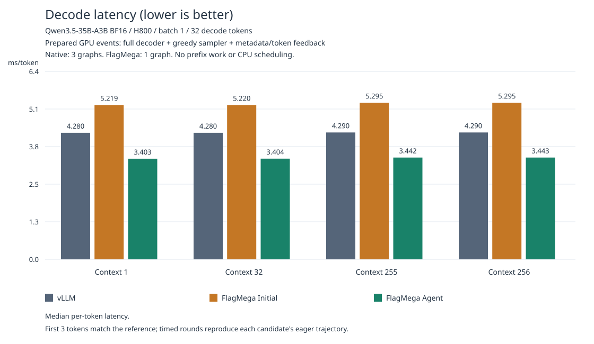
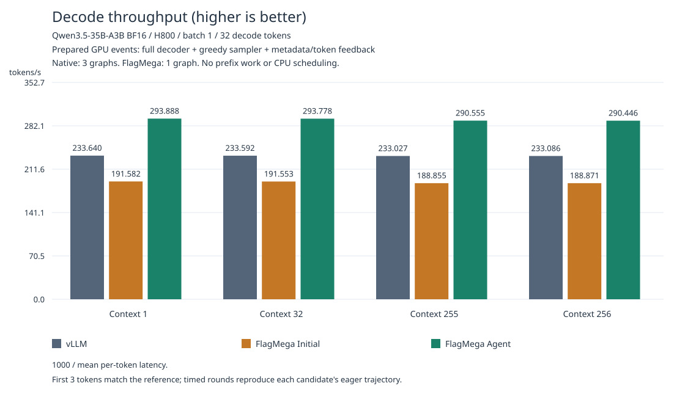

# Qwen3.5-35B-A3B BF16 / H800

Batch-one decode of the complete 40-layer model on one H800: 30 Gated DeltaNet
layers, 10 attention layers, routed/shared experts and greedy sampling.
Prefill, vision and serving integration are outside this benchmark.

## Results

All three variants ran sequentially on the same H800, with two warmup rounds
and five 32-token rounds per context. Latency is the pooled median; throughput
is `1000 / mean_ms`. FlagMega uses PyTorch 2.10.0+cu128 and PTXAS 13.3.73;
the [pinned vLLM environment](requirements-reference.txt) uses PyTorch 2.11.0+cu130.

| Context | vLLM ms/token | FlagMega Initial ms/token | FlagMega Agent ms/token |
| --- | ---: | ---: | ---: |
| 1 | 4.280 | 5.219 | 3.403 |
| 32 | 4.280 | 5.220 | 3.404 |
| 255 | 4.290 | 5.295 | 3.442 |
| 256 | 4.290 | 5.295 | 3.443 |

Agent's median decode speedup is 1.25x-1.26x over vLLM and 1.53x-1.54x
over FlagMega's out-of-the-box Initial configuration.




The first three generated tokens match the independent reference at every
context. Each timed 32-token graph replay must reproduce its candidate's own
eager trajectory; matching later reference tokens, logits or rounding is not
required. GPU events include the model, sampling, metadata and token feedback,
but exclude compilation, state preparation and CPU scheduling. These are not
serving-latency measurements. Data and fingerprints: [summary.json](figures/summary.json).

## Reproduce

Run from the repository root in a TLE-enabled FlagTree environment. Use a
separate vLLM environment for the reference and a new directory for each trial.
The pinned checkpoint needs about 71.9 GB, plus 64.6 GiB for packed weights.

```sh
conda activate flagtree
export TUTORIAL="$PWD/python/tutorials/flagmega/02-qwen3.5-35b-a3b-bf16/nvidia-h800"
export PYTHONPATH="$PWD/python:$TUTORIAL${PYTHONPATH:+:$PYTHONPATH}"
export WORK="$HOME/flagmega-qwen35"
export CHECKPOINT="$WORK/checkpoint"
export CUDA_VISIBLE_DEVICES=0
export OMP_NUM_THREADS=1 MKL_NUM_THREADS=1
mkdir -p "$WORK"

python "$TUTORIAL/prepare_checkpoint.py" --output "$CHECKPOINT"
python -m triton.flagmega compile --model "$CHECKPOINT" --full-model \
  --revision 59d61f3ce65a6d9863b86d2e96597125219dc754 --emit-executable \
  --output "$WORK/initial/artifact" --rdata-cache-dir "$WORK/rdata-cache"
python "$TUTORIAL/optimize_agent.py" --checkpoint "$CHECKPOINT" \
  --trial "$WORK/agent" --rdata-cache-dir "$WORK/rdata-cache"

python3.10 -m venv "$WORK/vllm-env"
env -u PYTHONPATH "$WORK/vllm-env/bin/python" -m pip install \
  -r "$TUTORIAL/requirements-reference.txt"
env -u PYTHONPATH "$WORK/vllm-env/bin/python" "$TUTORIAL/prepare_reference.py" \
  --checkpoint "$CHECKPOINT" --trial "$WORK/reference" --contexts 1 32 255 256 --steps 32

export TRITON_PTXAS_PATH="$WORK/vllm-env/lib/python3.10/site-packages/nvidia/cu13/bin/ptxas"
env -u PYTHONPATH "$WORK/vllm-env/bin/python" "$TUTORIAL/benchmark_vllm.py" \
  --checkpoint "$CHECKPOINT" --reference "$WORK/reference/report.json" \
  --trial "$WORK/vllm-check" --repeats 5
for variant in initial agent; do
  python "$TUTORIAL/accuracy.py" --checkpoint "$CHECKPOINT" \
    --artifact "$WORK/$variant/artifact" --reference "$WORK/reference/report.json" \
    --trial "$WORK/$variant-check" --label "$variant" --tokens 3 \
    --benchmark-steps 32 --benchmark-repeats 5
done
```

Run variants sequentially on an idle GPU. Regenerate the figures with:

```sh
python "$TUTORIAL/render_results.py" --reference "$WORK/reference/report.json" \
  --native "$WORK/vllm-check" --baseline "$WORK/initial-check" \
  --agent "$WORK/agent-check" --output "$WORK/figures"
```

## Implementation

**Initial** uses the standard compiler and default target, without tutorial
optimizations. **Agent** adds the workload-specific passes and kernel choices
in [agent_optimizations](agent_optimizations), through [optimize_agent.py](optimize_agent.py).
Both use the same compiler revision and native-BF16 import contract.

[generated_kernels.py](generated_kernels.py) is a generated source snapshot,
not a standalone model; execution also needs the artifact's IR, manifest and
packed weights. The snapshot was rebuilt and validated at all four contexts.

Build outputs include inspectable IR and fingerprinted artifacts.
